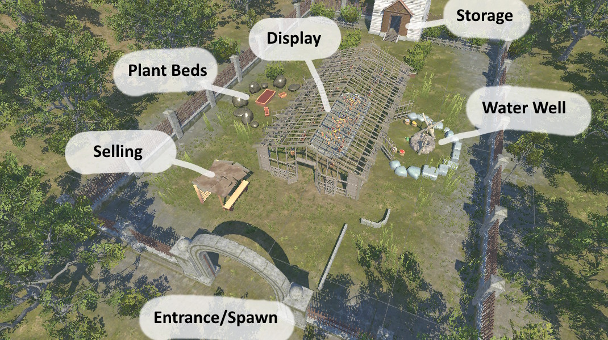

Overgrown VR is a cooperative plant growing simulator where players run a greenhouse together that runs on Google Cardboard.

* Move around using the joystick, and Press Trigger / OK to interact.
* Pressing trigger teleports on the ground using a raycast.
* Look at interactable objects and they will be outlined.
* Press the X button to open the pause menu, you can either Resume or Quit by pressing B.
* Press the trigger to interact with certain objects.
* Hold the trigger to pick up / grab certain objects.

---
NPCs will look at the Display area and ask you to grow a new flower for them.

To grow a flower:
* Grab a seed bag the customer wants from the back storage area.
* Plant it in one of the main plant beds on the left side greenhouse.
* Grab a watering can from the right side greenhouse.
* Fill that watering can using the well.
* If the customer wants a specific color, dye water using the dye sacks.
* Water the flower by interacting with the plant bed.
* Grab a pot the customer wants from the back storage area.
* While holding the pot, interact with a fully grown flower to put it in.

---

It sounds like a lot but our game is cooperative.
The 2nd player can help split up the tasks to deliver the plant faster.
For example, one player grabs seeds while the other gets pots to prevent backtracking.

To run on mobile devices, just start the game and you will be put in the lobbyScene.
One player can host the lobby, give the code to a friend, Then the 2nd player types in the code using the virtual number pad to join the lobby.

Our video demo of this can be found here: https://youtu.be/Sr6VoliiRlY

